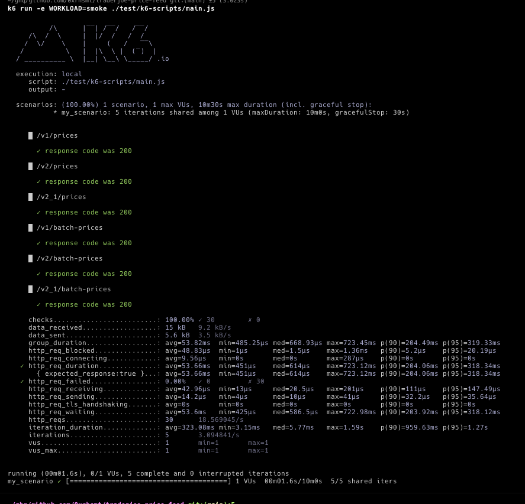

# Trader Joe Price Feed API

## Overview

This repository is for implementing the Price Feed API to participate in the [Price Feed API Bounty](https://docs.google.com/document/d/10t4IbY06jZ1WUZxO4qbVpklPC69Rnh_gdifLgFZ1lis/). <br>
Below, you will find details about the API specifications and implementation methods.

## API Interface

### Request and Response

<table>
<tr>
<td> URL path </td> <td> Request </td>  <td> Response </td>
</tr>
<tr>
<td> GET /v1/prices/:base/:quote </td>

<td>

```
URL path params:
{
    "base": Address,
    "quote": Address
}
```

</td>

<td>

```json
{
    "pair_address": Address,
    "base_address": Address,
    "quote_address": Address,
    "price": Number
}
```

</td>
</tr>
<tr>
<td> POST /v1/batch-prices </td>

<td>

```
body:
[
    Address,
]
```

</td>

<td>

```json
[
    {
        "pair_address": Address,
        "base_address": Address,
        "quote_address": Address,
        "price": Number
    },
]
```

</td>

</tr>

<tr>
<td> GET /v2/prices/:base/:quote/:binstep </td>

<td>

```
URL path params:
{
    "base": Address,
    "quote": Address,
    "binstep": Number,
}
```

</td>

<td>

```json
{
    "pair_address": Address,
    "base_address": Address,
    "quote_address": Address,
    "binstep": Number,
    "price": Number
}
```

</td>
</tr>
<tr>
<td> POST /v2/batch-prices </td>

<td>

```
body:
[
    Address,
]
```

</td>

<td>

```json
[
    {
        "pair_address": Address,
        "base_address": Address,
        "quote_address": Address,
        "binstep": Number,
        "price": Number
    },
]
```

</td>

</tr>

<tr>
<td> GET /v2_1/prices/:base/:quote/:binstep </td>

<td>

```
URL path params:
{
    "base": Address,
    "quote": Address,
    "binstep": Number,
}
```

</td>

<td>

```json
{
    "pair_address": Address,
    "base_address": Address,
    "quote_address": Address,
    "binstep": Number,
    "price": Number
}
```

</td>
</tr>
<tr>
<td> POST /v2_1/batch-prices </td>

<td>

```
body:
[
    Address,
]
```

</td>

<td>

```json
[
    {
        "pair_address": Address,
        "base_address": Address,
        "quote_address": Address,
        "binstep": Number,
        "price": Number
    },
]
```

</td>

</tr>

</table>

### Client Errors

<table>
<tr>
<td> Name </td> <td> HTTP Status Code </td> <td> Client Error Code </td> <td> Response </td>  <td> Description </td>
</tr>
<tr>
<td> RequestInputValidationError </td>
<td> 400 </td>
<td> 100 </td>

<td>

```json
{
    "code": 100,
    "reason": "Bad Request",
    "validationErrors": {
        "formErrors": [],
        "fieldErrors": {
            "params": [
                {
                    "path": [String],
                    "reason": String,
                    "code": String (ValidationErrorCode)
                }
            ]
        }
    }
}
```

</td>

<td>

Returned this error in case of validation errors on URL path parameters or request body.

</td>
</tr>

<tr>
<td> NotFoundError </td>
<td> 404 </td>
<td> 101 </td>

<td>

```json
{
  "code": 101,
  "reason": "Not Found"
}
```

</td>
<td>
</td>
</tr>

<tr>
<td> RequestTimeoutError </td>
<td> 408 </td>
<td> 102 </td>

<td>

```json
{
  "code": 102,
  "reason": "Request Timeout"
}
```

</td>
<td>
Returned this error in case of a timeout.<br />
Default timeout is 5 seconds.

</td>
</tr>

<tr>
<td> TooManyRequestsError </td>
<td> 429 </td>
<td> 103 </td>

<td>

```json
{
  "code": 103,
  "reason": "Too many requests, please try again later"
}
```

</td>
<td>
Returned this error when rate limit is exceeded.
</td>
</tr>

<tr>
<td> PairNoLiquidityError </td>
<td> 400 </td>
<td> 104 </td>

<td>

```json
{
  "code": 104,
  "reason": "Pair no liquidity"
}
```

</td>
<td>
Returned this error when there is no liquidity for a Liquidity Book Pair.
</td>
</tr>

<tr>
<td> TokenInfoFetchError </td>
<td> 400 </td>
<td> 105 </td>

<td>

```json
{
  "code": 105,
  "reason": "Failed to fetch token information..."
}
```

</td>
<td>
Returned this error when the requested token does not exist.
</td>
</tr>

<tr>
<td> PairInfoFetchError </td>
<td> 400 </td>
<td> 106 </td>

<td>

```json
{
  "code": 106,
  "reason": "Failed to fetch pair information..."
}
```

</td>
<td>
Returned this error when the requested Liquidity Book Pair Contract does not exist.
</td>
</tr>

</table>

## Design

### Philosophy

- Minimize network requests
  - [Calculate Pair addresses on the local side](https://github.com/0xrhsmt/traderjoe-price-feed/blob/1c221a9cfd3642996e35efc960057cdf5d1a1acc/src/entities/v1/Pair.ts#L6-L25)
  - [Use batch JSON-RPC requests](https://github.com/0xrhsmt/traderjoe-price-feed/blob/1c221a9cfd3642996e35efc960057cdf5d1a1acc/src/config/chainClient.ts#L14-L15)
  - [Cache as much as possible](https://github.com/search?q=repo%3A0xrhsmt%2Ftraderjoe-price-feed%20withCache&type=code)
- Avoid reinventing the wheel
  - Refer extensively to [Trader JOE SDKs](https://docs.traderjoexyz.com/)

### Cache

- Pair Asset Price information is cached until a new block is generated. [This cache expiration varies per chain](https://github.com/0xrhsmt/traderjoe-price-feed/blob/1c221a9cfd3642996e35efc960057cdf5d1a1acc/src/config/cache.ts#L6-L22).
- Immutable information in Token and Pair details is cached. This cache has no expiration. (ex. Token's decimals, Pair's token0/token1 addresses, etc...)

### Other Features

- [Request rate limiting](https://github.com/0xrhsmt/traderjoe-price-feed/blob/64bab9b867e462e6d1622a023810ec5bc74c8e13/src/middlewares/rateLimiter.ts#L1)
- [Request Timeout limiting](https://github.com/0xrhsmt/traderjoe-price-feed/blob/64bab9b867e462e6d1622a023810ec5bc74c8e13/src/middlewares/timeout.ts#L1)
- [Beauty logging using pino-logger](https://github.com/0xrhsmt/traderjoe-price-feed/blob/64bab9b867e462e6d1622a023810ec5bc74c8e13/src/middlewares/httpLogger.ts#L16)

## Development and Production Environments

### Prerequisites

- [nodejs v18.x.x](https://nodejs.org/en)
- [pnpm v8.x.x](https://pnpm.io/)
- [foundry](https://book.getfoundry.sh/getting-started/installation)

### Development Environment

#### Start local server

```bash
$cp .env.development.example .env.development.local
# And replace $JSON_RPC_URL value if you want to use your own Avalanche mainnet node.

$pnpm install

$pnpm run start:dev

$curl --location 'localhost:3000/v1/prices/0xB31f66AA3C1e785363F0875A1B74E27b85FD66c7/0xB97EF9Ef8734C71904D8002F8b6Bc66Dd9c48a6E' \
--header 'Content-Type: application/json'
$curl --location 'localhost:3000/v1/batch-prices' \
--header 'Content-Type: application/json' \
--data '["0xf4003F4efbe8691B60249E6afBd307ABe7758ADb"]'
```

#### Testing

Testing needs an Avalanche mainnet "archive" node and anvil to fetch the same on-chain data for test. <br>

```bash
$cp .env.test.example .env.test.local
# And you must replace $ANVIL_FORK_URL value with your own Avalanche "archive" node URL.
# (ex. https://avalanche-mainnet.infura.io/v3/xxxx)

$pnpm install

$pnpm run test:anvil
$pnpm run test
$pnpm run test:watch
```

##### Load Testing (Local 😭)

[install k6](https://k6.io/docs/get-started/installation/)

```bash
$cp .env.development.example .env
# And replace $JSON_RPC_URL value if you want to use your own Avalanche mainnet node.

$pnpm install
$pnpm build

$LOG_LEVEL=silent API_RATE_LIMIT_SKIP=true node dist/src/index.js

$k6 run -e WORKLOAD=smoke ./test/k6-scripts/main.js
$k6 run -e WORKLOAD=breaking ./test/k6-scripts/main.js
$k6 run -e WORKLOAD=spike ./test/k6-scripts/main.js
```



### Production

#### Build & Launch Server

```bash
$pnpm install

$pnpm run build
$node dist/src/index.js | pnpm exec pino-pretty
```

## References

- [Trader Joe Docs](https://docs.traderjoexyz.com/)
- [Trader Joe SDKs](https://github.com/traderjoe-xyz/joe-sdks)
